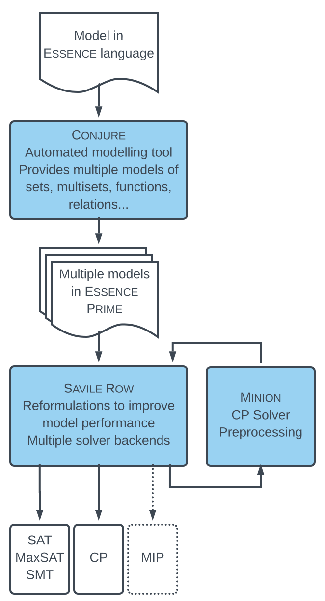

We offer below a complete constraint modelling toolchain that, starting with a constraint problem specification in the language Essence, performs the modelling and solving phases efficiently and automatically.



Content tests:


#!/bin/bash
# Passing arguments to a function
print_something () {
echo Hello $1
}
print_something World


```html
<html>
  <head>
  </head>
  <body>
    <p>Hello, World!</p>
  </body>
</html>
```

test
